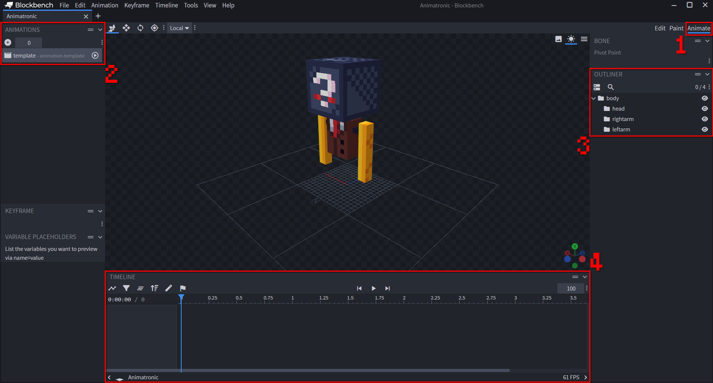
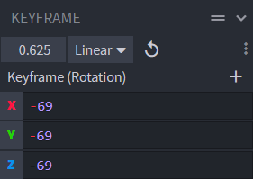
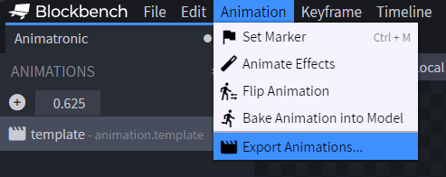

# Animating Animatronics using Blockbench

The Animatronics purpose is to be positioned and animated.
However, this can be difficult without additional help. But there are ways to make this process a lot easier!

**This guide will provide the needed resources to get started animating the Animatronic using [Blockbench](https://www.blockbench.net/)**

## Using Blockbench

The easiest way to plan out positions and animations is by using the `Animatronic.bbmodel` file.

**So first of, get the model [here](https://cccbridge.tweaked-programs.cc/resources/Animatronic.bbmodel)!** _And if Blockbench still is not installed, then now is the perfect moment for a [visit to their download page](https://www.blockbench.net/downloads)!_

### Basics

Now that everything is downloaded - _and hopefully installed as well:_ ...
{ loading=lazy }

1. **Open it up and head over to the `Animate` section.**
2. Notice the template animation on the left. You may just use it for now, or **delete and create a new one** for a better structure, **if you want to [export the animation](#export-animations) later**.
3. If you want **reposition a body part**, either click on it in the preview or **on the labeled bone**.
    * _Select the rotation tool by clicking on it on the toolbar, or by pressing `[R]`._
4. Animatronics only can apply one pose at the time. Consider this while animating them! In the timeline, **select the _frame_ indicating in which order a position is being pushed.** It is recommended to limit the usage to decimal numbers for simplicity later, _e.g. 1, 2, 3, ..._

!!! note
    For more complex animations, the Lua side part has to be manually implemented as well as there currently is no official provided module! This will be explained in [the corresponding section](#lua-animation-parser).

### Applying rotations

After repositioning the Animatronic however needed, the body part rotations now can be applied in two ways.
The lazy way is to copy and paste the the rotation values and push them manually.

The values can be viewed on the lower left corner after selecting the corresponding body part.
{ loading=lazy }

### Export Animations

In case for more complex tasks, Blockbench can export animations as `json` files. This can be very handy for integration in Lua code.

To export the `json` file, frist go to `Animation > Export Animations` in the tab section.
{ loading=lazy }

A popup then will open up. Select which animations you want to include in the file _(in case multible ones were made)_.
{ loading=lazy }

Finally, click on confirm and select where the `json` file should be saved.
For further instructions on how to integrate this in Lua code, head over to [the corresponding section](#lua-lnimation-parser).

## Lua Animation Parser

Reading the animations [from the generated json file](#export-animations) is the hardest part of this guide.
This section will try it's best to make this process as easy as possible however.

After [the file has been uploaded to the Computer](https://github.com/SquidDev-CC/FAQBot-CC/blob/master/faqs/file_transfer.md), we need to load and parse it before doing anything else with it.
??? example "Loading a `json` file in CC:Tweaked"
    This code can be used to load a `json` file. There are more efficient ways to do so, but this one should be solid.

    ```lua title="parse.lua"
    local path = "path/to/your/exported/animations"
    local file, err1 = fs.open(path, 'r')

    local parsed = {} -- Location for the later parsed animations

    if not file then
        -- Error while loading file
        local reason = ("Could not load given file '%s'. Reason: '%s'"):format(path, err1)
        error(reason)
    end

    -- Reading animations file
    local raw = file.readAll()
    file.close()

    -- Parsing
    local result, err2 = textutils.unserialiseJSON(raw)

    if not result then
        -- Error while parsing
        local reason = ("Could not parse file '%s'. Reason: '%s'"):format(path, err2)
        error(reason)
    end

    -- Success
    parsed = result
    ```

### Explanation of json animation files

With this aside, let's focus on the structure of the converted json data.
To do so, the following json file will be used as an example:
```json title="animation.animatronic.head-right-to-left.json"
{
	"format_version": "1.8.0",
	"animations": {
		"animation.template": {
			"animation_length": 1,
			"bones": {
				"head": {
					"rotation": {
						"0.0":      [0, 45, 0],
                        "0.0417":   [0, 0, 0],
						"1.0":      [0, -45, 0]
					}
				}
			}
		}
	}
}
```

The structure is pretty self-explanatory. Let's go over some relevant parts anyways:

* `"animations"`: **object**; Contains the animation objects _(e.g. `"animation.template"`)_.
    * `"animation_length"`: **number**; Determines how many frames the animation will run.
    * `"bones"`: **object**; Contains the bones objects that indicate how they change within every configured frame. It **may** contain an entry for the Animatronics bones: `body`, `head`, `rightarm` & `leftarm`.
        * `"rotation"`: **object**: Instructions for how the bone will change within frame `X`.

### 'Baking' the animations

The format is pretty simple to integrate and use. There is only one problem however.
The object `"rotation"` of each bone object saves the values using a string of the frame number as a key.

This may not be very practical for further code. Especially if keys like `"0.0417"` were used.
In order to simplify the the process in further code, we need to _bake_ the code, i.e., perform a conversion of sorts.

The following code can be used for this:

```lua hl_lines="15 21-31"
-- Assuming 'content' contains the parsed animation data
local parsed = { ... } -- Replace with actual parsed data

-- Create a table to hold the baked animations
local animations = {}

-- Loop through each animation entry in parsed data
for name, data in pairs(parsed.animations) do
    local baked = {} -- Create a table to hold the baked animation data for this entry
    
    -- Loop through each bone in the animation data
    for part, rots in pairs(data.bones) do
        baked[part] = {} -- Create a table to hold the baked bone rotation data
        
        -- Check if the rotation data is a single set of rotations or a series
        if type(rots.rotation[1]) == "number" then
            baked[part][1] = rots.rotation -- If single, add it as-is
        else
            local indexes = {}
            
            -- Collect and sort the frame indexes
            for index, rot in pairs(rots.rotation) do
                table.insert(indexes, index)
            end
            table.sort(indexes, function(a, b) return tonumber(a) < tonumber(b) end)
            
            -- Reorganize the rotation data using the sorted indexes
            for new_index, real_index in ipairs(indexes) do
                baked[part][new_index] = rots.rotation[real_index]
            end
        end
    end
    
    -- Add the baked animation data to the animations table
    animations[name] = baked
end

-- At this point, the 'animations' table contains the transformed animation data
```

**Consider taking a look at the marked lines for a deeper understanding of the problem solving  here!**

As a result, this is how the data would look like now:

=== "baked _(final Lua table)_"

    ```lua
    local animations = {
        ["animation.template"] = {
          head = {
            [1] = { 0, 45, 0 },
            [2] = { 0, 0, 0 },
            [3] = { 0, -45, 0 }
          }
        }
    }
    ```

=== "unbaked _(only parsed)_"

    ```lua
    local parsed = {
        format_version = "1.8.0",
        animations = {
          ["animation.template"] = {
            bones = {
              head = {
                rotation = {
                  ["0.0417"] = { 0, 0, 0 },
                  ["0.0"] = { 0, 45, 0 },
                  ["1.0"] = { 0, -45, 0 }
                },
              },
            },
            animation_length = 1
          }
        }
    }
    ```

Our new baked version now is much simpler to handle and contains about the same amount of needed informations as before!
It also is easily adjustable.